# sub.tv

**O futebol de base mineiro, do primeiro apito ao histórico inteiro.**

Toda a Sub-13 e a Sub-14 de Minas Gerais num só lugar: tabela, elencos, artilharia, súmulas e quase dez temporadas de números, prontos para quem narra, comenta ou só acompanha. E quando a bola rola, a tela ao vivo coloca o campo, o placar e os 22 jogadores na sua frente.

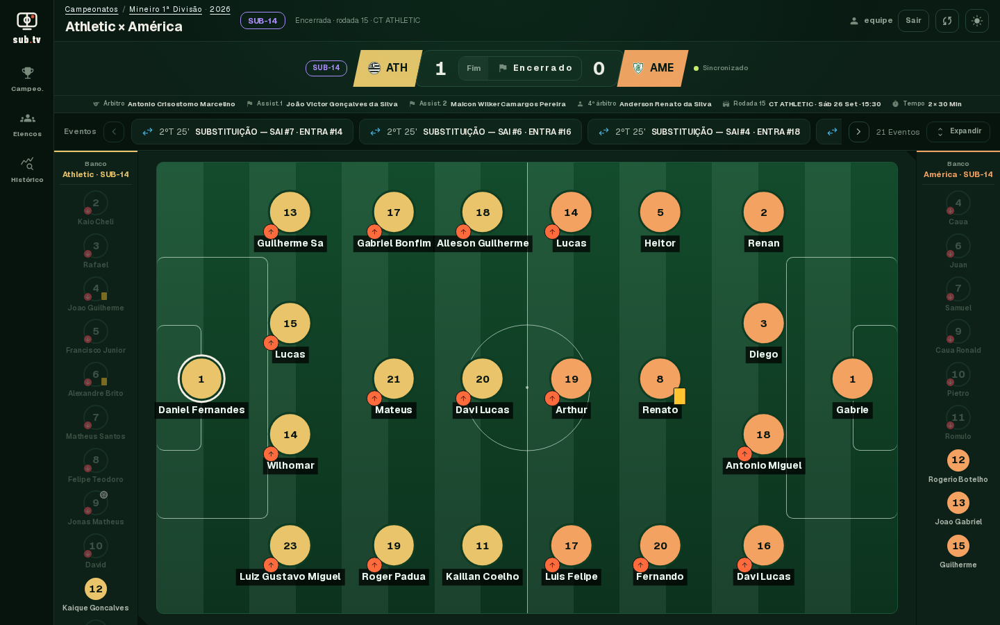

---

## Por que sub.tv

O futebol de base tem história, mas ela está espalhada em tabelas, PDFs de súmula e anotações de quem estava no jogo. Na hora da transmissão, ninguém tem tempo de procurar. O sub.tv junta tudo isso e deixa a informação a um clique, para que a narração fale dos atletas pelo nome, pelo número e pelo que eles já fizeram.

## O que você encontra

### Campeonatos da temporada

Cada campeonato com classificação atualizada, artilharia e todas as partidas, com placar, rodada, data e local. Troque de temporada num clique e veja como estava a tabela em qualquer ano.

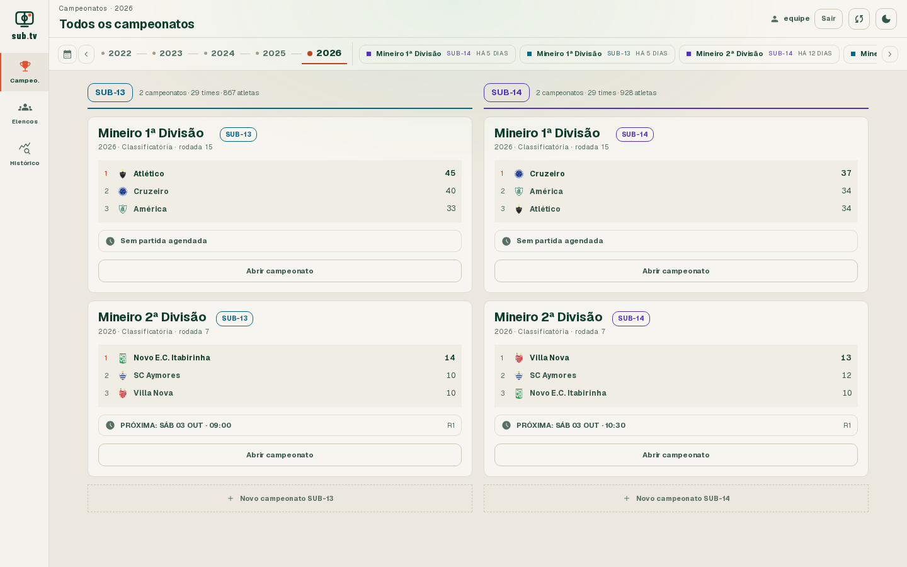

| Classificação                                                     | Estatísticas                                                    |
| ----------------------------------------------------------------- | --------------------------------------------------------------- |
| 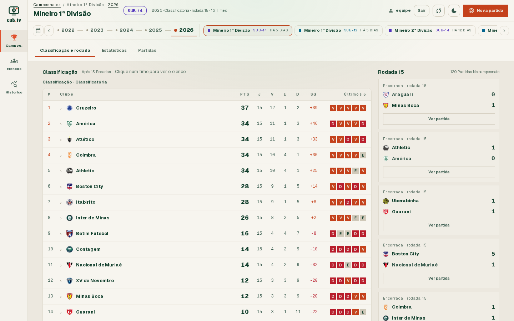 | 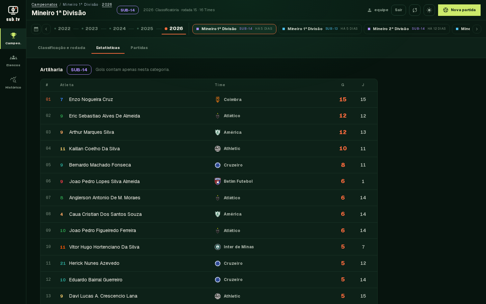 |

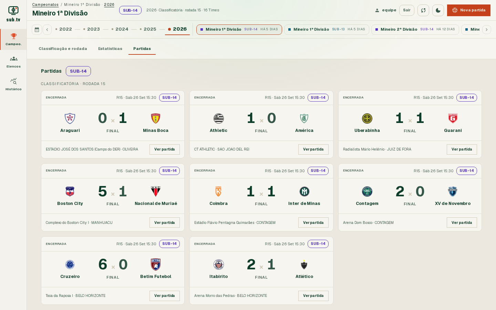

### Elencos de todos os clubes

Clube por clube, categoria por categoria: número, nome, posição, jogos, gols e cartões de cada atleta. Busque por nome ou número e chegue no jogador em segundos.

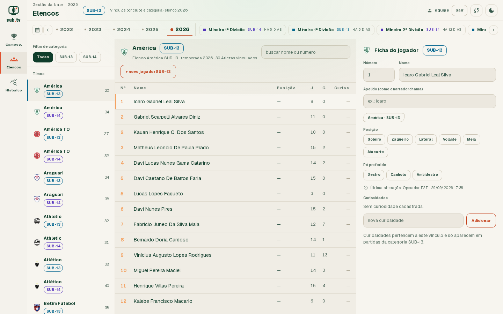

### Histórico desde 2017

Gols por jogo, maiores artilheiros, quem mais jogou, aproveitamento de cada clube e campanha temporada a temporada. Cada time e cada atleta tem sua própria página, com gráficos e a trajetória completa.

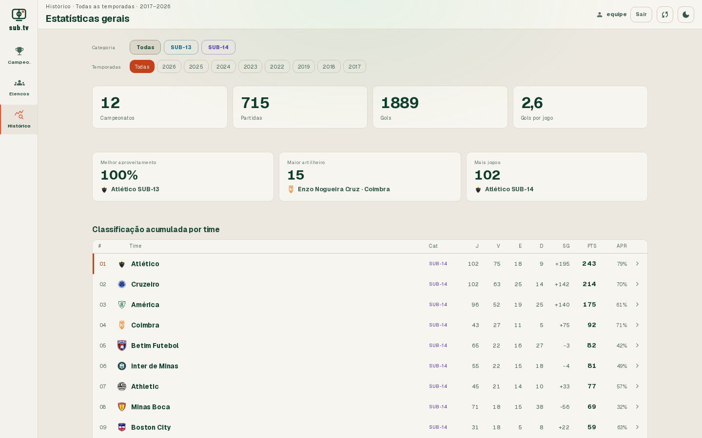

| Página do time                                                           | Página do atleta                                                              |
| ------------------------------------------------------------------------ | ----------------------------------------------------------------------------- |
| 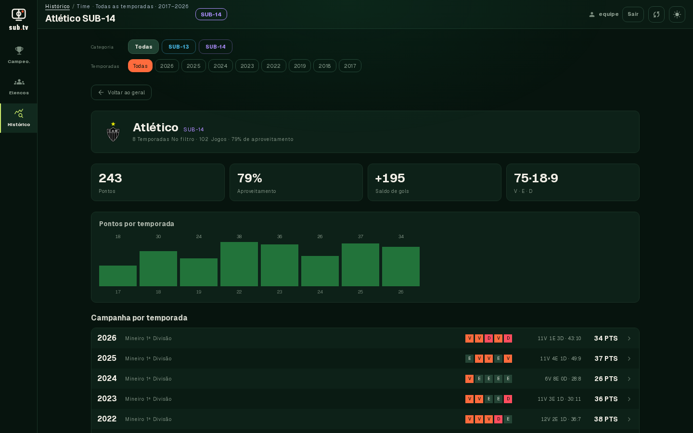 | 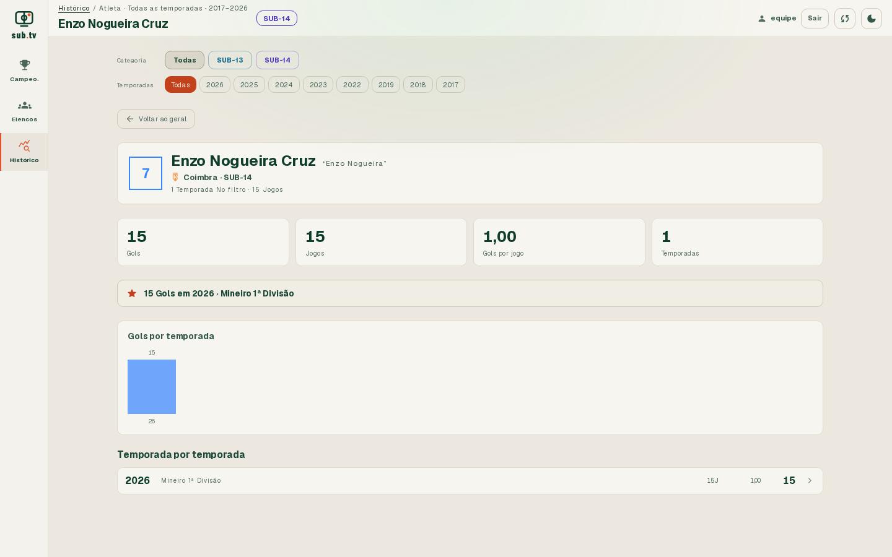 |

### Tela ao vivo

Monte a partida em quatro passos (informações, times, escalações e revisão) e vá direto para a transmissão. O campo tático mostra os 22 titulares e os bancos; o placar, o relógio e a faixa de eventos (gols, cartões, substituições) ficam sempre à vista. Clique num jogador e o que você precisa saber sobre ele está ali.

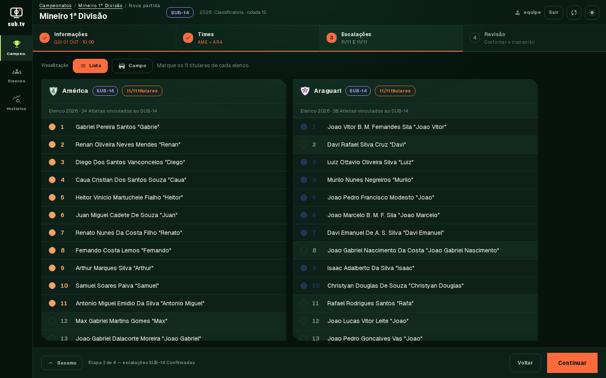

### Curiosidades da equipe

Apelido de narração, posição, pé preferido e aquelas histórias que só quem acompanha a base sabe. Tudo o que a equipe cadastra fica guardado e nunca é apagado pela atualização automática.

## Sempre em dia

Os dados vêm da Federação Mineira de Futebol e são atualizados sozinhos todos os dias, às 6 h da manhã: jogos novos, resultados e súmulas das competições em andamento entram sem ninguém precisar digitar nada.

## Feito para usar de verdade

- **Aberto para consulta.** Campeonatos, elencos e histórico podem ser vistos por qualquer pessoa, sem cadastro.
- **Protegido para editar.** Criar partida, narrar ao vivo e alterar elencos exige login, e cada mudança fica registrada com o nome de quem a fez.
- **Claro ou escuro.** Tema claro para o dia a dia e escuro para a cabine de transmissão.
- **Do monitor ao celular.** A mesma ferramenta funciona na mesa de transmissão e no bolso, na beira do campo.
- **Rápido.** As páginas abrem quase instantaneamente e a tela ao vivo responde no mesmo instante do clique.

| Tema claro                                                     | Tema escuro                                               |
| -------------------------------------------------------------- | --------------------------------------------------------- |
| 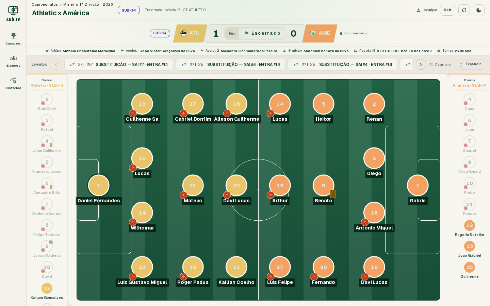 |  |

  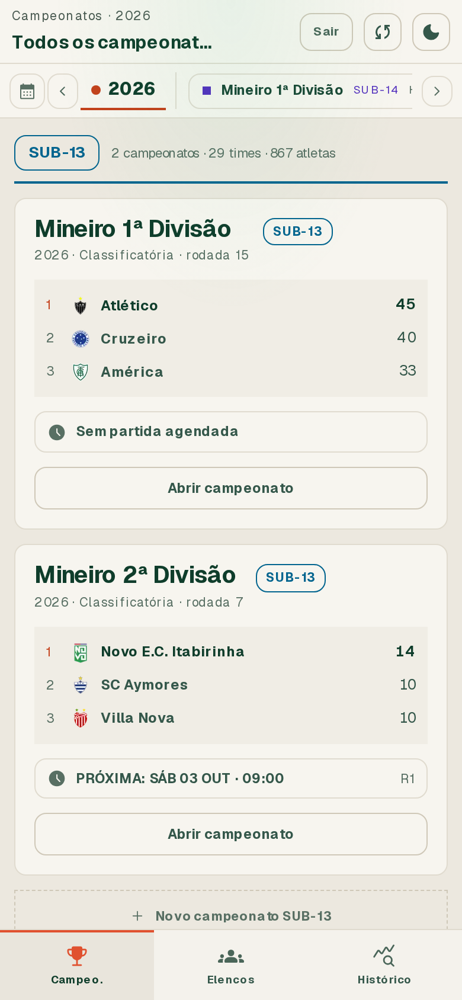
  &nbsp;&nbsp;
  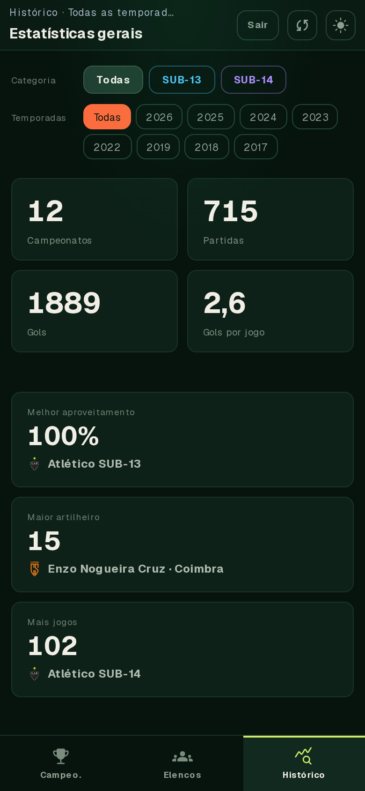

## Cuidado com quem está em campo

Os atletas são menores de idade, e o sub.tv foi pensado com isso em mente: não guarda data de nascimento, não publica documentos e mostra só o que interessa ao jogo.

---

Quer rodar o projeto, contribuir ou fazer o deploy? Veja [DEVELOPMENT.md](DEVELOPMENT.md).
